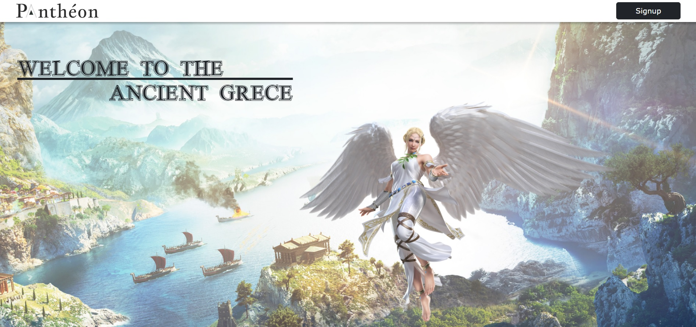
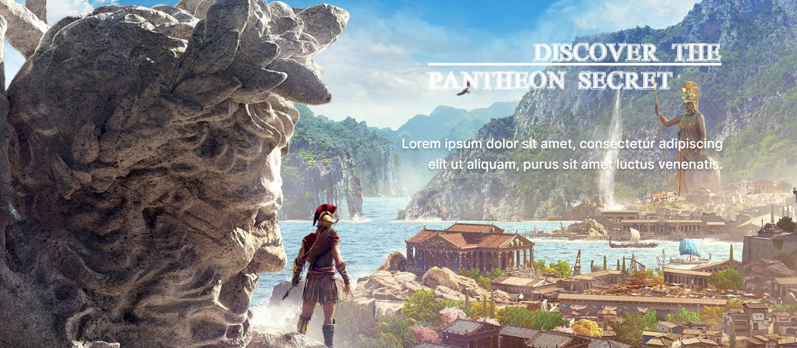
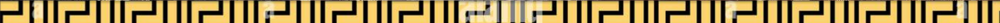
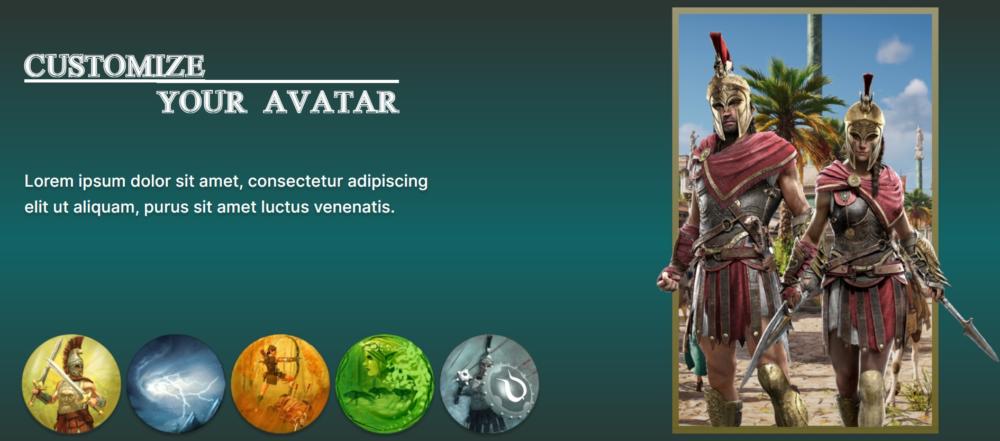

# Pantheon Game Project

This project was generated with [Angular CLI](https://github.com/angular/angular-cli) version 13.3.3.

 

 ⚔ Pantheon is my current Website about a video game based on Greek mythology ⚔<br />
 The different features are still under study

## Development server

* Run dev server :
```
ng serve
``` 
Navigate to `http://localhost:4200/`. The application will automatically reload if you change any of the source files.

* Install all depencencies :
```
npm install
```
To make sur you everything work correctly.

In the idea, the site is a mix between <strong>Assassin's Creed</strong> and <strong>Titan Quest</strong><br />
Some pictures of the website :
 
 
 


